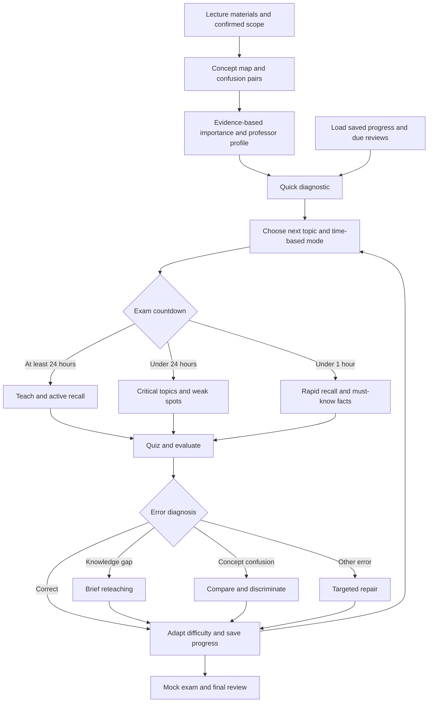

# AI Exam Study Assistant

An open-source Agent Skill for university students.

It turns lecture PDFs/PPTs, exam scope, notes, professor announcements, and past exams into an evidence-grounded study workflow.

## Works with Codex and Claude Code

This repository ships native local skill locations for both coding agents:

```text
.agents/skills/ai-exam-study-assistant/   # Codex
.claude/skills/ai-exam-study-assistant/   # Claude Code
```

The canonical source lives here:

```text
skills/ai-exam-study-assistant/
```

When the skill changes, run:

```bash
python scripts/sync-skill.py
```

The two local copies are then synchronized.

## What it does — v1.1

Analyze exam scope → prioritize → diagnose → teach → quiz → classify mistakes → adapt → review.

| New capability | Behavior |
|---|---|
| Diagnostic-first planning | 5–10 initial questions; prioritize exam importance, personal weakness, confusion risk and study time |
| Error-specific repair | Separate missing knowledge, concept confusion, retrieval, application, procedure, misreading and guessing; choose a different follow-up for each |
| Professor style profile | Analyze supplied exams, quizzes, assignments and lecture emphasis; separate Observed, Inferred and Unknown |
| Explicit exam modes | Learn (7+ days), Practice (1–6 days), Exam (under 24h), Cram (under 1h); shift from teaching to rapid retrieval |
| Persistent mistake memory | Save course-specific mastery, confusion pairs, answer history and next-review dates in local files; show due reviews on return |

### Adaptive study workflow



Generated questions are practice, not predictions of actual exam questions. Modes use the confirmed exam datetime and timezone; the study budget is tracked separately.

## Example prompts

```text
Here are my lecture PDFs. The exam covers chapters 2–6.
I have 4 hours. Build my study plan.
```

```text
Quiz me on the highest-priority topics.
Ask one question at a time and don't show the answer until I respond.
```

```text
I got the last two questions wrong.
Teach me the difference between these concepts and test me again.
```

```text
My exam is tomorrow. Create a 30-minute final review.
```

## Evidence-first design

The skill separates:
- confirmed source facts
- reasonable inferences
- AI predictions

It must not claim to know what will appear on an exam unless that is explicitly supported by the supplied materials.

## Repository layout

```text
ai-exam-study-assistant/
├── .agents/
│   └── skills/
│       └── ai-exam-study-assistant/
├── .claude/
│   └── skills/
│       └── ai-exam-study-assistant/
├── skills/
│   └── ai-exam-study-assistant/
├── scripts/
│   └── sync-skill.py
├── AGENTS.md
├── CLAUDE.md
├── README.md
├── LICENSE
└── .gitignore
```

## Installation

### Codex

Clone the repository and work from the repository root. Codex can discover the skill under `.agents/skills/`.

You can also copy `.agents/skills/ai-exam-study-assistant/` into another repository's `.agents/skills/` directory.

### Claude Code

Clone the repository and work from the repository root. Claude Code can discover the skill under `.claude/skills/`.

You can also copy `.claude/skills/ai-exam-study-assistant/` into another repository's `.claude/skills/` directory.

## No server required

The skill is instruction-first. It does not require:
- an API server
- a database
- a paid backend
- API keys

The host agent's available file/document tools determine how lecture materials are read.

## Persistent progress and reminders

Python 3 is optional for teaching and required for the bundled state helper. The agent should run it from the installed skill directory:

```bash
python skills/ai-exam-study-assistant/scripts/study-state.py --root .study/my-course init
python skills/ai-exam-study-assistant/scripts/study-state.py --root .study/my-course due
```

After each graded answer, the agent records an event using `record --event <json-file>`. See the skill's `references/learning-state.md` for the event format. Progress lives in `.study/<course-id>/state.json`; the professor profile and session handoff use the same private directory. `.study/` is excluded from Git.

Review intervals use a simple 1/3/7/14/30-day heuristic; missed retrieval returns to a 1-day interval. **Reminders appear when you start another session. This package does not send background notifications.** Files must remain available on the same device or be privately transferred. If storage is unavailable, tracking remains session-only and the agent must say so.

## Package type

This is an instruction-first Agent Skill package for Codex and Claude Code, with a Python state helper. It does not include a marketplace plugin manifest or a background service. Copying an installed skill must include its scripts, references and templates.

## Validation

```bash
python scripts/sync-skill.py
python -m unittest discover -s tests -v
```

Tests exercise state persistence across helper processes, review scheduling, confusion tracking, duplicate events and invalid-state handling. They do not certify AI teaching quality or exam predictions.

## Roadmap

- Optional background reminder integrations
- Automatic PDF/slide extraction helpers
- Progress dashboard
- More sophisticated spaced-repetition scheduling
