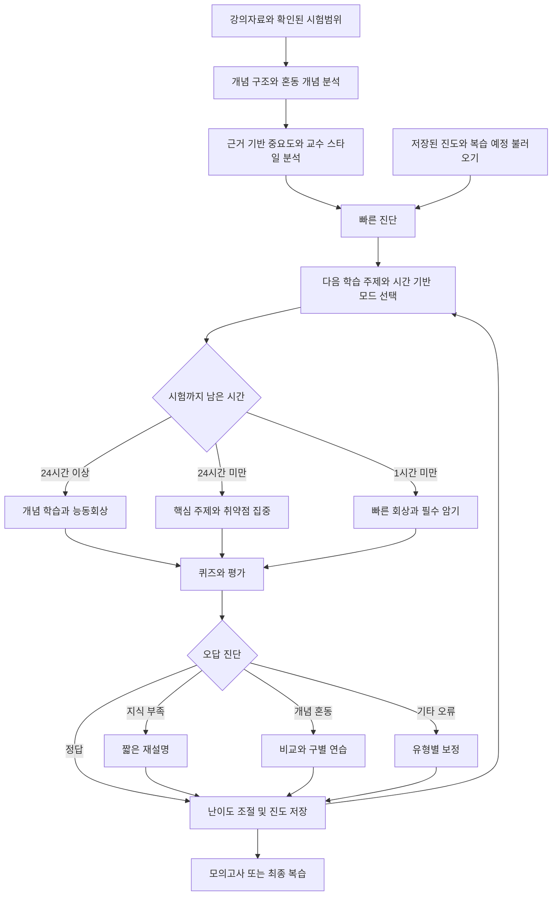

# AI 시험공부 어시스턴트 v1.2

한국인 대학생을 위한 오픈소스 Agent Skill입니다.

강의 PDF/PPT, 시험범위, 필기, 교수 공지, 과거 시험을 넣으면 단순 요약이 아니라 **시험범위 분석 → 중요도 판단 → 진단 → 학습 → 퀴즈 → 오답 추적 → 적응형 난이도 → 최종 복습**의 실제 시험공부 루프를 실행합니다.

## v1.2 핵심 변경점

**한국어 기본 동작**을 추가했습니다.

- 사용자가 다른 언어를 요청하지 않는 한 설명·퀴즈·채점·오답 피드백·최종 복습을 한국어로 제공합니다.
- 영어 강의자료도 설명은 한국어로 합니다.
- 시험에 필요한 핵심 전공 용어는 필요할 때 `한국어(English)`로 병기합니다.
- 시험 범위 분석, 오답 노트, 최종 복습 템플릿을 한국어로 현지화했습니다.
- 내부 상태 키와 Python 스키마는 v1.1과 호환됩니다.

## Codex와 Claude Code에서 사용

이 저장소는 두 에이전트가 바로 발견할 수 있는 로컬 스킬 경로를 포함합니다.

```text
.agents/skills/ai-exam-study-assistant/   # Codex
.claude/skills/ai-exam-study-assistant/   # Claude Code
```

원본 스킬은 아래 경로에 있습니다.

```text
skills/ai-exam-study-assistant/
```

원본을 수정한 뒤 다음 명령으로 두 로컬 스킬을 동기화합니다.

```bash
python scripts/sync-skill.py
```

## 주요 기능

| 기능 | 동작 |
|---|---|
| 진단 우선 학습계획 | 5~10개의 초기 문제로 현재 수준을 확인하고 시험 중요도·취약도·혼동 위험·공부시간을 함께 고려 |
| 오답 유형별 보정 | 지식 부족, 개념 혼동, 회상 실패, 적용 실패, 절차 오류, 문제 오독, 찍기/과신을 구분해 다른 후속 학습 적용 |
| 교수 출제 스타일 분석 | 과거 시험·퀴즈·과제·강의 강조점을 바탕으로 확인됨 / 추정 / 정보 부족으로 구분 |
| 시간 기반 시험 모드 | 7일 이상 학습 / 1~6일 연습 / 24시간 미만 시험 직전 / 1시간 미만 초압축 |
| 지속형 오답 기억 | 과목별 숙련도, 혼동 개념, 답안 이력, 다음 복습일을 로컬에 저장하고 다음 세션에 복습 예정 항목 제시 |
| 한국어 기본 출력 | 영어 자료를 넣어도 한국어 중심으로 설명하고 핵심 전공 용어만 필요 시 원문 병기 |

## 학습 워크플로우



생성된 문제는 **실제 시험문제 예측이 아니라 연습문제**입니다. 시험 모드는 확인된 시험 날짜·시간·시간대를 기준으로 정하며, 실제 공부 가능한 시간은 별도로 관리합니다.

## 사용 예시

```text
여기 강의 PDF들이 있어. 시험범위는 2~6장이야.
오늘 4시간 공부할 수 있어. 무엇부터 공부해야 하는지 계획 짜줘.
```

```text
가장 중요한 주제부터 퀴즈 내줘.
한 문제씩 내고 내가 답하기 전에는 정답을 보여주지 마.
```

```text
방금 두 문제 연속 틀렸어.
내가 어떤 개념을 헷갈리는지 설명하고 다시 문제 내줘.
```

```text
시험이 내일이야. 30분짜리 최종 복습 만들어줘.
```

영어 강의자료도 그대로 넣을 수 있습니다.

```text
이 논문과 영어 강의 슬라이드를 시험범위로 공부해야 해.
설명은 한국어로 해주고, 시험에 필요한 영어 전공 용어는 같이 적어줘.
```

## 근거 우선 설계

스킬은 다음을 구분합니다.

- **확인됨**: 자료에 직접 존재하는 사실
- **추정**: 자료를 바탕으로 한 합리적인 해석
- **예측**: 근거를 바탕으로 AI가 추정한 가능성

자료에 명시되지 않은 내용을 “시험에 나온다”고 단정하지 않습니다.

## 저장소 구조

```text
ai-exam-study-assistant/
├── .agents/
│   └── skills/
│       └── ai-exam-study-assistant/
├── .claude/
│   └── skills/
│       └── ai-exam-study-assistant/
├── skills/
│   └── ai-exam-study-assistant/
├── scripts/
│   └── sync-skill.py
├── tests/
├── AGENTS.md
├── CLAUDE.md
├── README.md
├── LICENSE
└── .gitignore
```

## 설치

### Codex

저장소를 clone한 뒤 저장소 루트에서 작업하면 Codex가 `.agents/skills/` 아래의 스킬을 찾을 수 있습니다.

다른 프로젝트에 사용할 경우 `.agents/skills/ai-exam-study-assistant/` 폴더를 해당 프로젝트의 `.agents/skills/` 아래에 복사할 수도 있습니다.

### Claude Code

저장소를 clone한 뒤 저장소 루트에서 작업하면 Claude Code가 `.claude/skills/` 아래의 스킬을 찾을 수 있습니다.

다른 프로젝트에 사용할 경우 `.claude/skills/ai-exam-study-assistant/` 폴더를 해당 프로젝트의 `.claude/skills/` 아래에 복사할 수도 있습니다.

## 서버 불필요

이 스킬은 instruction-first 패키지입니다. 다음이 필요하지 않습니다.

- API 서버
- 데이터베이스
- 유료 백엔드
- API 키

강의자료를 읽는 방식은 Codex/Claude Code 등 호스트 에이전트가 제공하는 파일·문서 도구를 사용합니다.

## 학습 진도와 복습 기억

개념 학습 자체에는 Python이 필수는 아니지만, 지속형 상태 저장 기능에는 Python 3가 필요합니다.

```bash
python skills/ai-exam-study-assistant/scripts/study-state.py --root .study/my-course init
python skills/ai-exam-study-assistant/scripts/study-state.py --root .study/my-course due
```

채점 후에는 `record --event <json-file>` 형태로 학습 이벤트를 저장합니다. 자세한 형식은 `references/learning-state.md`를 참고하세요.

진도는 `.study/<course-id>/state.json`에 저장됩니다. 교수 스타일과 세션 인계 정보도 같은 개인 폴더를 사용할 수 있습니다. `.study/`는 Git에서 제외됩니다.

기본 복습 간격은 1/3/7/14/30일 휴리스틱을 사용합니다. 실패하면 다시 1일 간격으로 돌아갑니다. **백그라운드 알림은 보내지 않으며, 다음 학습 세션을 시작했을 때 복습 예정 항목을 보여줍니다.**

## 패키지 유형

Codex와 Claude Code용 instruction-first Agent Skill 패키지이며, Python 상태 저장 도우미가 포함되어 있습니다. 별도의 마켓플레이스 플러그인 manifest나 백그라운드 서비스는 포함하지 않습니다.

## 검증

```bash
python scripts/sync-skill.py
python -m unittest discover -s tests -v
```

테스트는 상태 저장, 복습 일정, 혼동 개념 추적, 중복 이벤트, 잘못된 상태 처리 등을 확인합니다. AI의 교육 품질이나 실제 시험 예측 정확도를 보증하는 테스트는 아닙니다.

## Roadmap

- 선택형 백그라운드 복습 알림 연동
- PDF/슬라이드 자동 추출 도우미
- 학습 진도 대시보드
- 더 정교한 간격 반복 알고리즘
